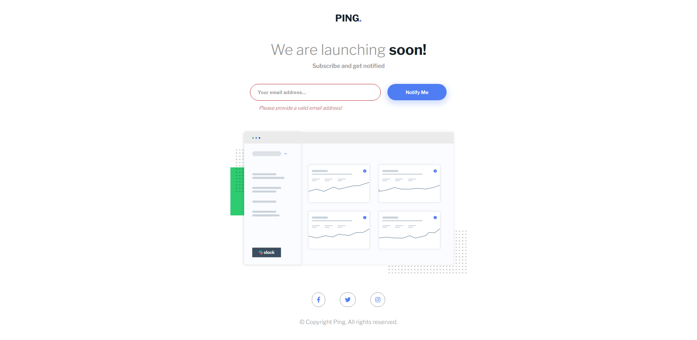

- Live Site URL: [Click me!](https://johnhaab.github.io/ping-coming-soon-page-master/)

### Overview

Completed challenge.

### Built with

- HTML5 markup
- CSS custom properties (GRID CSS)

## Author

- Twitter - [@johnlhaab](https://www.twitter.com/johnlhaab)


Preview.




## Table of contents

- [Overview](#overview)
  - [Links](#links)
- [My process](#my-process)
  - [Built with](#built-with)
  - [What I learned](#what-i-learned)
- [Author](#author)

## Overview

I started learning Front end web development on 12/05/22, this is the first challenge I have used javaScript on and I found it super fun.

### Links

- Solution URL: [Click me!](  )
- Live Site URL: [Click me!](https://johnhaab.github.io/ping-coming-soon-page-master/)

## My process

First I started with adding what I need in index.html to get everything working, then I started my styles.css, and last I added my index.js code.

### Built with

- Semantic HTML5 markup
- JavaScript
- CSS custom properties

### What I learned

I learned about Javascript functions and if statments.

Code snippets, see below:

```html
<div class="email-field">
          <form id="form">
            <input
              id="input"
              type="email"
              value=""
              placeholder="Your email address..."
            />
            <button id="btn">Notify Me</button>
            <p id="err-msg">Please provide a valid email address!</p>
          </form>
        </div>
```
```css
#input {
    padding: .9rem 1.25rem;
    width: 55%;
    border-radius: 4rem;
    outline: 1px solid var(--secondary-color-gray);
    border: none;
    transform: translate(-.5rem, 0rem);
}

.email-field button {
    padding: .9rem 1.25rem;
    width: 25%;
    border-radius: 4rem;
    background-color: var(--primary-color);
    border: none;
    font-family: var(--main-font);
    font-weight: 600;
    color: #fff;
    transform: translate(.5rem, 0rem);
    box-shadow: hsl(223, 87%, 63%, .25) 0px 6px 15px 4px;
    cursor: pointer;
}
```
```javascript
const inputEmail = document.getElementById
("input");
const submitBtn = document.getElementById
("btn");
const form = document.getElementById
("form");

submitBtn.addEventListener("click", (e) => {
    e.preventDefault();
    const regEx = /^\w+([\.-]?\w+)*@\w+([\.-]?\w+)*(\.\w{2,3})+$/;

    if (inputEmail.value.match(regEx)) {
        console.log("valid");
        form.classList.remove("error");
    }else{
        console.log("error");
        form.classList.add("error");
    }
})
```

## Author

- Frontend Mentor - [@johnhaab](https://www.frontendmentor.io/profile/johnhaab)
- Twitter - [@johnlhaab](https://www.twitter.com/johnlhaab)
